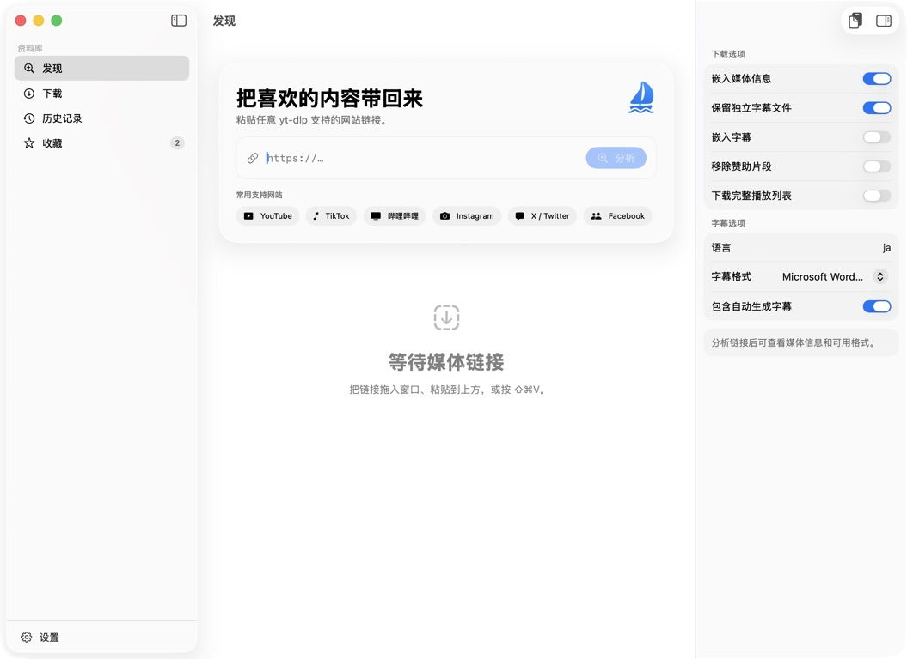

# MediaHarbor

[简体中文](README.md) | English | [繁體中文](README_ZH-HANT.md) | [日本語](README_JA.md)

MediaHarbor is a modern, native media downloader for macOS powered by [yt-dlp](https://github.com/yt-dlp/yt-dlp). Built from the ground up with SwiftUI, it provides format selection, audio extraction, playlists, subtitles, metadata, SponsorBlock, browser cookies, download queues, live progress, and local history.

[Download the latest release](https://github.com/jason312928/MediaHarbor/releases/latest) · [Browse yt-dlp supported sites](https://github.com/yt-dlp/yt-dlp/blob/master/supportedsites.md)

## Interface preview

MediaHarbor uses a native three-column macOS design. Its sidebar, content area, and collapsible detail panel adapt together as the window changes, keeping download options and common actions easy to reach.

| Discover and download options | Favorite groups and media details |
| --- | --- |
|  |  |

## Highlights

- Native SwiftUI interface for macOS 14 and later
- Liquid Glass on macOS 26 and adaptive system materials on earlier releases
- Adaptive window expansion for the sidebar and inspector, with automatic column collapse when screen space is limited
- An animated, collapsible detail panel shared by Discover, Downloads, History, and Favorites
- Live switching between English, Simplified Chinese, Traditional Chinese, and Japanese
- Works with the broad yt-dlp supported-sites catalog, including YouTube, TikTok, Bilibili, Instagram, X / Twitter, Facebook, Twitch, Vimeo, SoundCloud, and Reddit
- Installs and updates the official `yt-dlp_macos` release on demand
- URL drag and drop, clipboard analysis, keyboard commands, menu bar progress, and Finder reveal
- Aspect-ratio-aware thumbnails for landscape and portrait media, including sites that require source-page request headers
- Video, audio-only, and subtitle-only downloads with discovered manual/automatic caption languages, SRT/VTT/ASS or Microsoft Word DOCX output, separate files, and embedding
- Automatic FFmpeg discovery in common installation locations and cleanup of temporary processing files after each job
- A JSONL command-line interface for Codex, Claude Code, and other agents, with capability discovery, analysis, downloads, progress events, and reliable exit codes
- Playlists, metadata, browser cookies, and SponsorBlock; signed-in or restricted media can use cookies directly from common browsers
- Download queue with progress, speed, ETA, cancellation, notifications, and local history
- Searchable history with media filters, sorting, date groups, and per-record cleanup; Favorites add persistent source links and custom groups
- Automatic detection of downloaded files removed from disk, with contextual actions to download again, open, reveal in Finder, copy the path, or delete
- No accounts, ads, analytics, or bundled tracking

## Requirements

- macOS 14 Sonoma or later
- Prebuilt GitHub Release packages currently support Apple Silicon (arm64) only; Intel Mac users can build from source with Swift 6
- Swift 6 toolchain for source builds
- FFmpeg for merging and post-processing; Homebrew users can run `brew install ffmpeg`

MediaHarbor downloads yt-dlp from its official GitHub release when the user chooses **Install yt-dlp**. The executable is stored at:

```text
~/Library/Application Support/MediaHarbor/Tools/yt-dlp
```

## Build and run

```bash
git clone https://github.com/jason312928/MediaHarbor.git
cd MediaHarbor
./script/build_and_run.sh
```

```bash
swift build
./script/test.sh
./script/build_and_run.sh --verify
MEDIAHARBOR_VERSION=1.4.0 ./script/build_and_run.sh --package
```

## Codex / Claude Code interface

Agents can invoke the same download service used by the App:

```bash
swift run MediaHarbor capabilities
swift run MediaHarbor download "MEDIA_URL" --quality 1080p --output "$PWD/downloads" --no-app-settings
swift run MediaHarbor download "MEDIA_URL" --quality subtitles --sub-format docx --sub-langs "zh-Hans,en"
```

For an installed App, invoke `/Applications/MediaHarbor.app/Contents/MacOS/MediaHarbor` directly. Standard output uses JSON Lines. See the [agent interface specification](Documentation/AGENT_INTERFACE.md) for all options, events, and exit codes.

Package mode creates versioned DMG and ZIP artifacts for the current architecture in `dist/`.

## Project layout

```text
Sources/MediaHarbor/
├── App/          App entry point, scenes, and menus
├── Models/       Media and download value types
├── Services/     yt-dlp installation, argument building, and process execution
├── Stores/       Application state, download queue, and local history
├── Support/      Localization, formatting, self-checks, and visual styles
└── Views/        SwiftUI feature surfaces and reusable components
Documentation/    Architecture and release documentation
script/           Build, run, test, and packaging entry points
```

See [Documentation/ARCHITECTURE.md](Documentation/ARCHITECTURE.md) for the data flow and extension points. Download capabilities are composed as focused `DownloadArgumentContributor` implementations, so features such as proxies, rate limits, or chapter splitting do not need to modify the process runner.

## Legal and responsible use

Only download media you are authorized to access. Follow applicable website terms, copyright law, and local regulations. MediaHarbor does not bypass DRM and is not affiliated with yt-dlp or any supported website.

## Acknowledgments

- [yt-dlp](https://github.com/yt-dlp/yt-dlp) provides the media extraction and download engine at the heart of MediaHarbor.
- [SponsorBlock](https://sponsor.ajay.app/) provides community-maintained data for the optional segment-removal integration.

## License

MIT. See [LICENSE](LICENSE).
